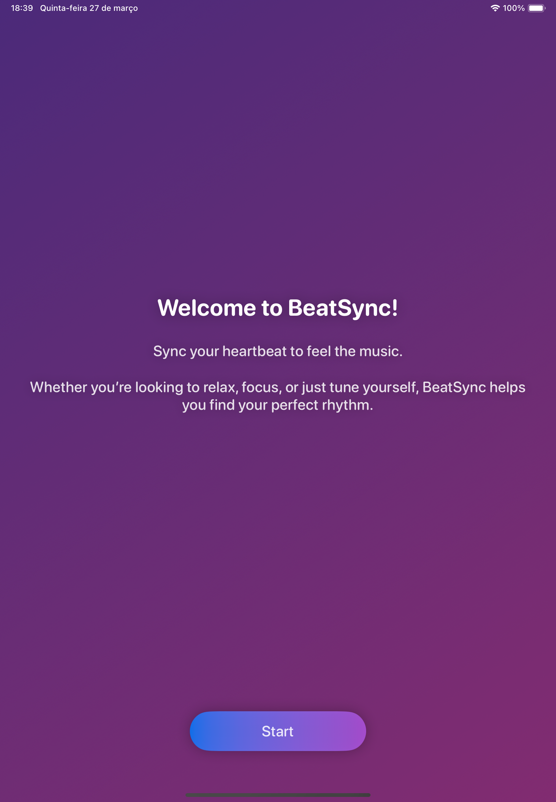

# BeatSync (WWDC25)

<p align="center">
  
</p>

## Swift Student Challenge Winner 2025

BeatSync is an award-winning project recognized in the **Swift Student Challenge 2025** by Apple. This app synchronizes music with the user's heart rate, creating a fully personalized sound experience.

Built with **SwiftUI** and **AVFoundation**, it allows users to adjust and modify music tracks based on their BPM in real-time.

---

## Features

* **BPM Synchronization**: Automatically adjusts music tracks based on your heart rate.
* **Track Selection**: Choose from drums, synths, and bass to create your sound.
* **Audio Effects**: Add reverb and ambient sounds like ocean waves and rain.
* **Modern UI**: Animated design with a Launchpad-style button layout.
* **Apple Watch Integration**: Real-time BPM tracking using HealthKit.
    * *Note: Due to Playground limitations, the Apple Watch integration is simulated for testing purposes.*

## Technologies Used

* **SwiftUI**: For declarative UI development.
* **AVFoundation**: For core audio processing and playback.
* **AudioToolbox**: For additional audio functionality.
* **SceneKit**: For 3D music immersion elements.

## How to Run the Project

1.  Clone the repository to your local machine:
    ```bash
    git clone [https://github.com/PauloBrand7/BeatSync-WWDC25.git](https://github.com/PauloBrand7/BeatSync-WWDC25.git)
    ```
2.  Open the project in **Xcode**.
3.  Ensure the app target is set to **Swift Playgrounds** or an iPad/Mac simulator.
4.  Run the project to experience the real-time BPM-based music synchronization.

## Screenshots

<table align="center" style="border:none;">
  <tr style="border:none;">
    <td align="center" valign="top">
      <strong>Start Screen</strong><br><br>
      
    </td>
    <td align="center" valign="top">
      <strong>Heart Rate Sync</strong><br><br>
      
    </td>
    <td align="center" valign="top">
      <strong>Launchpad</strong><br><br>
      
    </td>
    <td align="center" valign="top">
      <strong>Audio Player</strong><br><br>
      
    </td>
  </tr>
</table>

## License

This project is licensed under the MIT License. See the [LICENSE](LICENSE) file for details.
