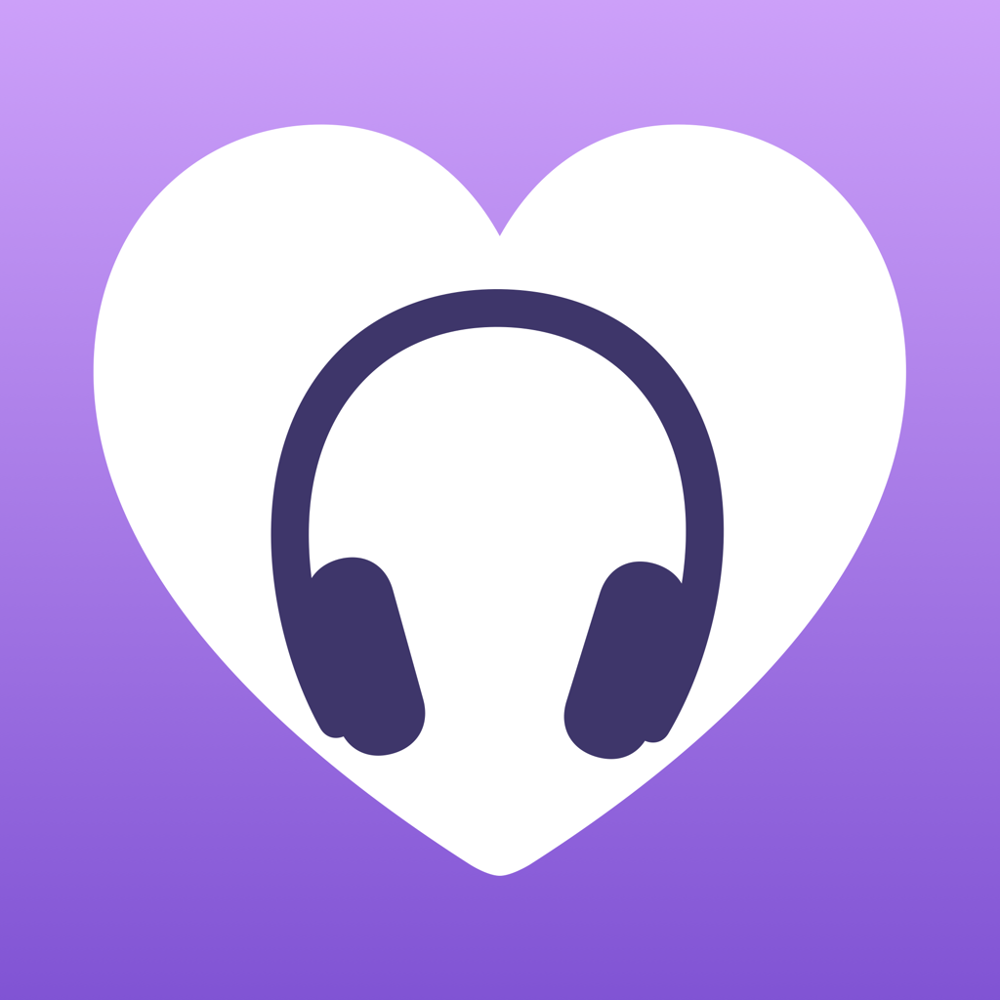
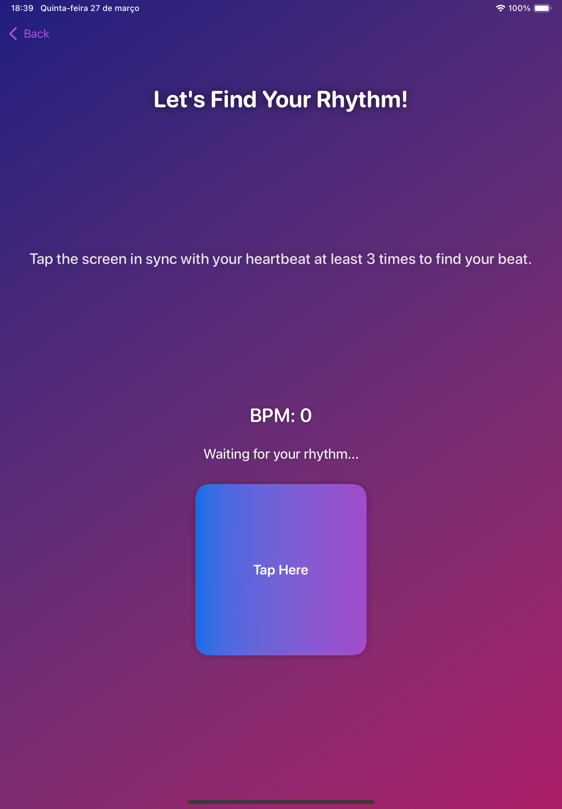
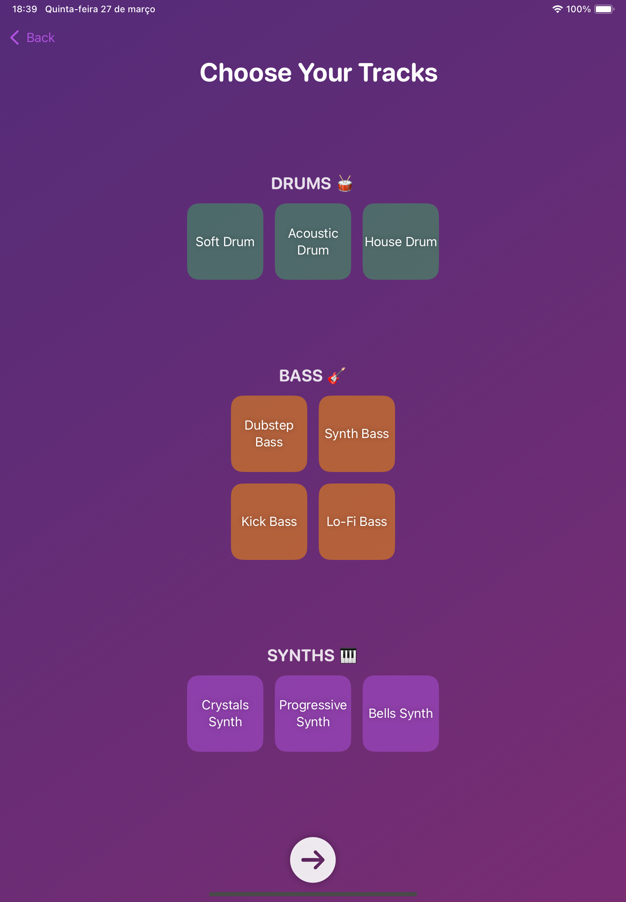

# BeatSync (WWDC2025) 


## 🏆 Swift Student Challenge Winner 2025
BeatSync is an award-winning project recognized in the **Swift Student Challenge 2025** by Apple! This app synchronizes music with the user's heart rate, creating a fully personalized sound experience. Built with **SwiftUI** and **AVFoundation**, it allows users to adjust and modify music tracks based on their BPM in real-time.

## ✨ Features
- 🎚️ **BPM Synchronization**: Automatically adjusts music tracks based on your heart rate.
- 🎵 **Track Selection**: Choose from drums, synths, and bass to create your sound.
- 🎛️ **Audio Effects**: Add reverb and ambient sounds like ocean waves and rain.
- 🎨 **Modern UI**: Animated design with a Launchpad-style button layout.
- ⌚ **Apple Watch Integration**: Real-time BPM tracking using HealthKit. *Note: Due to Playground limitations, the Apple Watch integration is simulated for testing purposes.*

## 🛠️ Technologies Used
- **SwiftUI** for UI development
- **AVFoundation** for audio processing
- **AudioToolbox** for additional audio functionality
- **SceneKit** for 3D music immersion

## 🚀 How to Run the Project
1. Clone the repository:
   ```bash
   git clone https://github.com/PauloBrand7/BeatSync-WWDC25.git
   ```
2. Open the project in **Xcode**.
3. Ensure the app runs in **Swift Playgrounds** or on a simulator.
4. Run and experience real-time BPM-based music synchronization! 🎶

## 📸 Screenshots
<div>
  
  
  
</div>

## 📜 License
This project is licensed under the MIT License. See the [LICENSE](LICENSE) file for details.
